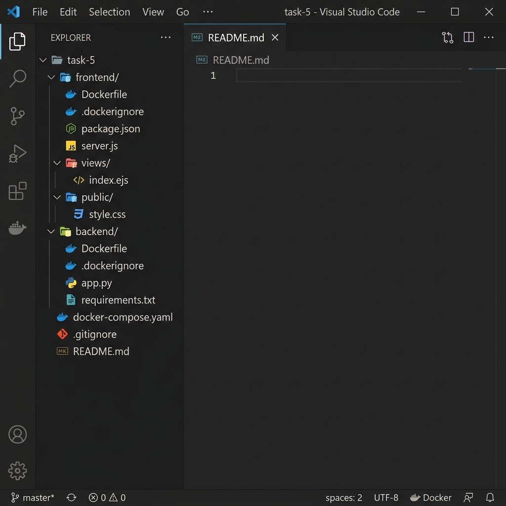
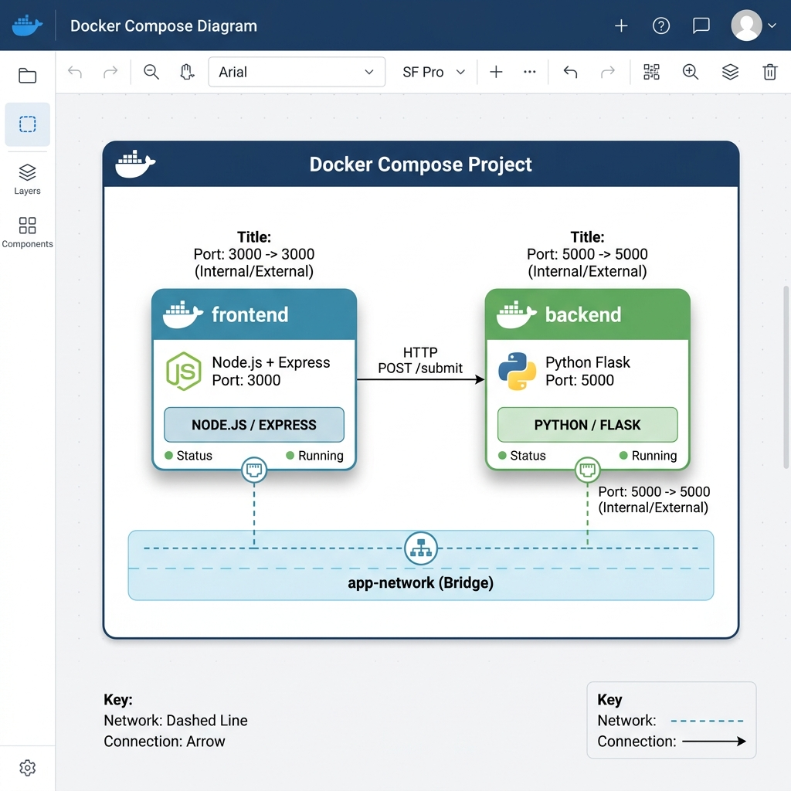
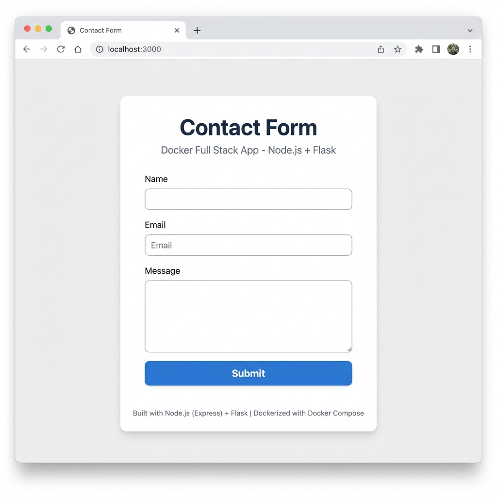
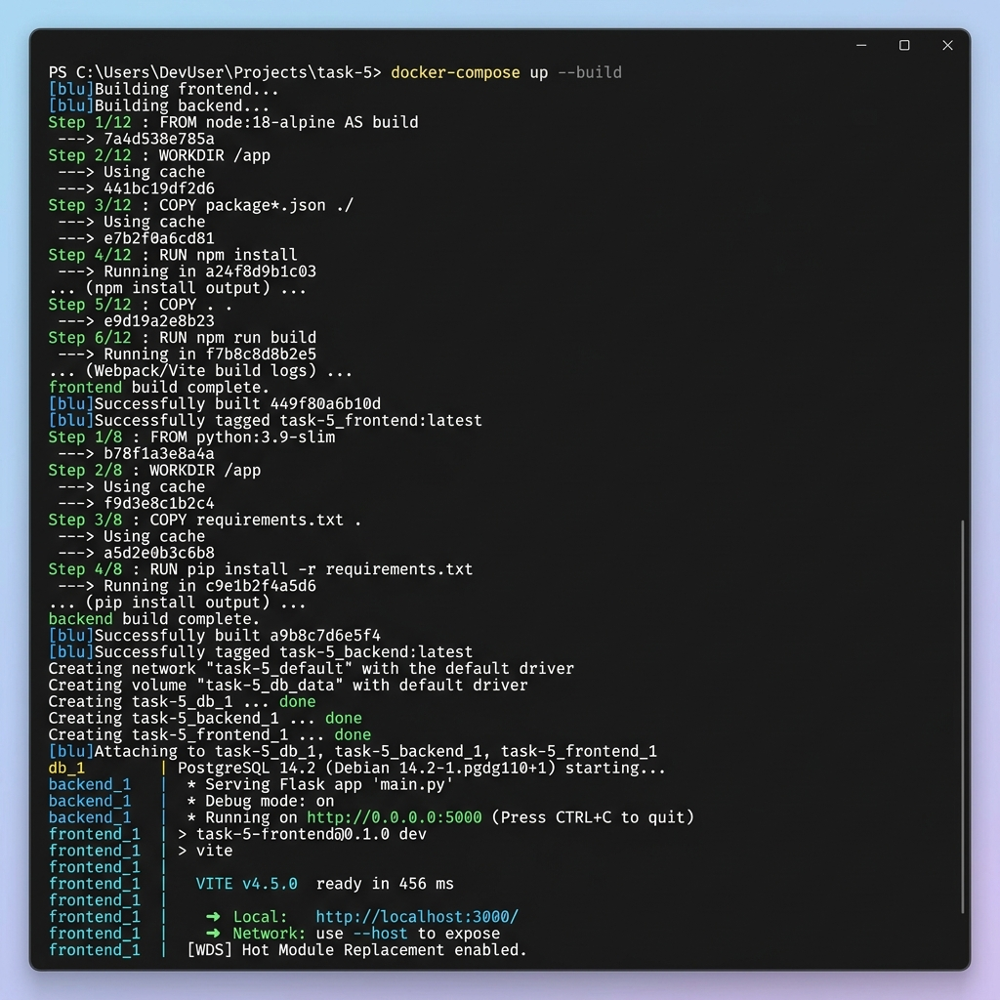

# 🐳 Docker Full Stack App — Task 5

> A containerized full-stack web application featuring a **Node.js (Express)** frontend and a **Python (Flask)** backend, orchestrated with **Docker Compose**.

---

## 📸 Screenshots

### Project Structure


### Architecture Diagram


### Contact Form UI (Frontend — Port 3000)


### Docker Compose Build & Run


---

## 📖 Overview

This project demonstrates how to build and deploy a **multi-container** application using Docker Compose. The frontend serves a contact form, and upon submission, it sends the data to the Flask backend via an internal Docker network. Both services are containerized independently and communicate over a custom bridge network.

---

## 🏗️ Architecture

```
┌──────────────────────────────────────────────────────┐
│                  Docker Compose                       │
│                                                       │
│   ┌─────────────────┐       ┌─────────────────┐      │
│   │    Frontend      │       │    Backend       │      │
│   │  Node.js/Express │──────▶│  Python/Flask    │      │
│   │   Port: 3000     │ HTTP  │   Port: 5000     │      │
│   └─────────────────┘ POST  └─────────────────┘      │
│           │            /submit        │               │
│           │                           │               │
│      ─────┴───────────────────────────┴─────          │
│                  app-network (bridge)                  │
└──────────────────────────────────────────────────────┘
```

| Component | Technology | Port | Description |
|-----------|-----------|------|-------------|
| **Frontend** | Node.js + Express + EJS | `3000` | Serves the contact form and forwards submissions to the backend |
| **Backend** | Python + Flask | `5000` | REST API that receives and validates form data |
| **Network** | Docker Bridge | — | Custom `app-network` enabling service-name resolution |

---

## 📁 Project Structure

```
task-5/
├── frontend/
│   ├── Dockerfile           # Node 18 Alpine-based image
│   ├── .dockerignore        # Excludes node_modules, .git, etc.
│   ├── package.json         # Dependencies: express, axios, ejs
│   ├── server.js            # Express server with form handling
│   ├── views/
│   │   └── index.ejs        # Contact form template
│   └── public/
│       └── style.css        # Form styling
├── backend/
│   ├── Dockerfile           # Python 3.9 slim-based image
│   ├── .dockerignore        # Excludes __pycache__, venv, etc.
│   ├── app.py               # Flask API with /submit endpoint
│   └── requirements.txt     # Dependencies: Flask, flask-cors
├── docker-compose.yaml      # Orchestration config
├── screenshots/             # Proof screenshots
├── .gitignore               # Git exclusions
└── README.md                # This file
```

---

## 🚀 How to Run

### Prerequisites

- [Docker](https://docs.docker.com/get-docker/) installed and running
- [Docker Compose](https://docs.docker.com/compose/install/) (v2+)

### Steps

```bash
# 1. Clone the repository
git clone https://github.com/syedibad52/task-5-tutedude.git
cd task-5-tutedude/task-5

# 2. Build and start both containers
docker-compose up --build

# 3. Open the application
#    Frontend:  http://localhost:3000
#    Backend:   http://localhost:5000

# 4. Stop the containers
docker-compose down
```

### Running in Detached Mode

```bash
docker-compose up --build -d     # Run in background
docker-compose logs -f           # Follow logs
docker-compose down              # Stop everything
```

---

## ⚙️ How It Works

### 1. User Opens the Form
The browser loads `http://localhost:3000`, which serves the EJS template with a styled contact form.

### 2. User Submits the Form
When the form is submitted, the Express server receives the POST request at `/submit`.

### 3. Frontend Forwards to Backend
The Express server sends the form data as JSON to the Flask backend at `http://backend:5000/submit`. The hostname `backend` resolves via Docker's internal DNS on the `app-network`.

### 4. Backend Validates and Responds
Flask validates that all fields (`name`, `email`, `message`) are filled. On success, it returns a JSON response with the submitted data. On failure, it returns a `400` error.

### 5. Frontend Displays Result
The Express server re-renders the page with either a green success banner or a red error message.

---

## 🔧 Environment Variables

| Variable | Service | Default | Description |
|----------|---------|---------|-------------|
| `BACKEND_URL` | Frontend | `http://localhost:5000` | URL of the Flask backend. In Docker Compose, set to `http://backend:5000` to use container DNS resolution. |

---

## 🐋 Docker Hub

To push the images to Docker Hub:

```bash
# Login to Docker Hub
docker login

# Tag the images
docker tag task-5-frontend <your-dockerhub-username>/task5-frontend:latest
docker tag task-5-backend <your-dockerhub-username>/task5-backend:latest

# Push to Docker Hub
docker push <your-dockerhub-username>/task5-frontend:latest
docker push <your-dockerhub-username>/task5-backend:latest
```

---

## 🩺 Health Checks

Both services include health checks in `docker-compose.yaml`:

| Service | Health Check | Interval | Retries |
|---------|-------------|----------|---------|
| **Frontend** | `wget --spider http://localhost:3000` | 30s | 3 |
| **Backend** | Python `urllib` check on `http://localhost:5000/` | 30s | 3 |

The frontend uses `depends_on` with `condition: service_healthy` to ensure the backend is fully ready before starting.

---

## 📝 Key Learnings

1. **Docker Compose Networking** — Containers on the same Docker Compose network can reach each other using their service names as hostnames (e.g., `http://backend:5000`).
2. **CORS Handling** — Since the frontend and backend are separate services, `flask-cors` is required to allow cross-origin requests.
3. **Layer Caching** — Copying `package.json` / `requirements.txt` before the rest of the source code allows Docker to cache dependency installation layers.
4. **Health Checks** — Using health checks with `depends_on` conditions ensures services start in the correct order.
5. **Security** — Running Flask with `debug=False` in production prevents the interactive debugger from being exposed.

---

## 🐛 Challenges & Solutions

| Problem | Solution |
|---------|----------|
| CORS error when frontend called backend | Added `flask-cors` to the backend |
| `localhost` not resolving between containers | Used service name `backend` instead of `localhost` for inter-container communication |
| Flask `debug=True` security risk | Changed to `debug=False` for production |
| Frontend starting before backend was ready | Added `depends_on` with `service_healthy` condition and health checks |

---

## 🛠️ Tech Stack

| Layer | Technology |
|-------|-----------|
| Frontend | Node.js 18 + Express 4 + EJS 3 |
| Backend | Python 3.9 + Flask 3.0 |
| HTTP Client | Axios 1.6 |
| Containerization | Docker + Docker Compose |
| Template Engine | EJS |
| CORS | flask-cors 4.0 |

---

## 📄 License

This project was created as part of the **TuteDude Docker Assignment (Task 5)**.
